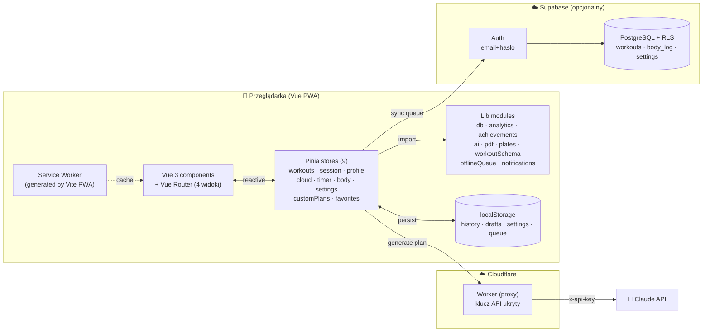
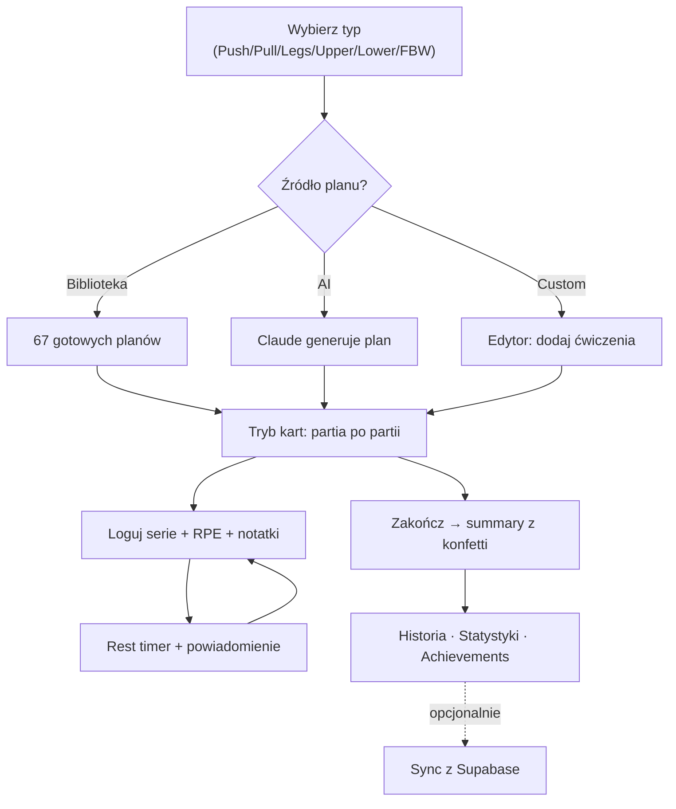

<div align="center">

# 💪 Trening Pro

### Inteligentna aplikacja treningowa z planami generowanymi przez AI

Twój osobisty trener siłowy w przeglądarce — generuje plany dopasowane do Twojego celu,
prowadzi Cię przez trening seria po serii i analizuje postępy. Działa offline jako PWA.

[](https://lukaszbonio.github.io/trening/)
[](#technology-stack)
[](https://vitejs.dev/)
[](https://www.anthropic.com/)
[](#features)
[](#license)

[**🚀 Demo na żywo**](https://lukaszbonio.github.io/trening/) · [**📦 Repozytorium**](https://github.com/LukaszBonio/trening) · [**🐛 Zgłoś błąd**](https://github.com/LukaszBonio/trening/issues)

</div>

---

## 📖 Spis treści

- [O projekcie](#o-projekcie)
- [Demo](#demo)
- [Features](#features)
- [Quick Start](#quick-start)
- [Instalacja na telefonie](#instalacja-na-telefonie-jak-natywna-aplikacja)
- [Development](#development)
- [Environment Variables](#environment-variables)
- [Architecture](#architecture)
- [Technology Stack](#technology-stack)
- [Jak korzystać (UX)](#jak-korzystać-ux)
- [Systemy treningowe](#systemy-treningowe)
- [FAQ](#faq)
- [Roadmap](#roadmap)
- [Known Issues](#known-issues)
- [Prywatność i bezpieczeństwo](#prywatność-i-bezpieczeństwo)
- [License](#license)

---

## O projekcie

**Trening Pro** to aplikacja webowa (PWA) do planowania i rejestrowania treningów siłowych.
Plany generuje **Claude** (model `claude-sonnet-4-6`) z uwzględnieniem Twojego celu i historii.

Aplikacja zbudowana jest na **Vue 3 + Vite + Pinia** — modularna struktura komponentów z reaktywnym
state management i lazy-loaded routingiem. PWA z Service Workerem zapewnia działanie offline.
Klucz API jest ukryty za serwerem proxy (Cloudflare Worker) — **użytkownik nie potrzebuje własnego klucza API.**

> **Dla kogo?** Dla osób trenujących siłowo, które chcą gotowego planu na dziś, prostego
> rejestrowania serii i czytelnej analizy postępów — bez zakładania konta i bez opłat.

---

## Demo

| | Link |
|---|---|
| 🚀 **Aplikacja na żywo** | <https://lukaszbonio.github.io/trening/> |
| 📦 **Kod źródłowy** | <https://github.com/LukaszBonio/trening> |

> Otwórz na telefonie i **dodaj do ekranu głównego**, aby korzystać jak z natywnej aplikacji.

---

## Features

### 🎯 Plany treningowe
- **10 typów treningu** — Push/Pull/Legs, Upper A/B, Lower A/B, FBW A/B/C
- **67 gotowych planów offline** + **276 ćwiczeń** w bazie ze słownikiem 25 głów mięśniowych
- **Generator AI** — Claude tworzy spersonalizowany plan z cel + sprzęt + wykluczenia
- **Edytor własnych planów** — twórz, edytuj, duplikuj plany z drag-drop reorderingu ćwiczeń
- **Ulubione** — gwiazdka przypina najczęściej używane plany na górze listy
- **Powtórz ostatni trening** — jeden klik, ciężary z poprzedniej sesji pre-fillowane

### 🏋️ Rejestrowanie treningu
- **Tryb kart** (domyślny) — jedna partia mięśniowa na ekran, swipe między kartami
- **Tryb listy** — wszystkie ćwiczenia w jednym widoku (toggle w ustawieniach)
- **Logowanie serii** — ciężar, powtórzenia, RPE (1-10), notatki tekstowe
- **Timer odpoczynku** — auto-start po zaznaczeniu serii, presety 60/90/120/180s, ±15s
- **Powiadomienia + wibracja** — koniec przerwy działa nawet w tle
- **Live duration** — zegar treningu w nagłówku sesji (mm:ss)
- **Kalkulator talerzy** — wpisz ciężar, zobacz rozkład per stronę (kolory IPF)
- **Auto-zapis draft** — przerwana sesja persystuje w localStorage, wraca po reload
- **Workout summary** — modal po zakończeniu: serie, tonaż, RPE, **nowe rekordy + konfetti**

### 📊 Statystyki i analiza
- **5 kafelków na górze** — treningi total, streak (tygodni), 7 dni, łączne serie, wolumen
- **Wolumen w czasie** (line chart) i **treningi w tygodniach** (bar chart)
- **Kalendarz heatmap** — GitHub-style siatka 26 tygodni, klik dnia → szczegóły
- **Per-exercise progress** — wybierz ćwiczenie, zobacz krzywą **1RM / top weight / wolumen**
- **Top 10 PR** — ranking rekordów osobistych ze wzorem Epley (1RM ≈ weight × (1 + reps/30))
- **Wolumen wg partii mięśniowej** — paski z rankingiem najbardziej trenowanych grup
- **14 osiągnięć** — milestones (10/25/50/100/250 treningów, streak 2/4/8/12 tyg., 100kg club, body log)

### ☁️ Synchronizacja w chmurze
- **Konta Supabase** (email + hasło) — opcjonalne, dane lokalne działają bez konta
- **Sync deltami** — workouts, body log, settings synchronizują się automatycznie (debounce 1.5s)
- **Offline queue** — gdy brak internetu, operacje kolejkowane → auto-flush po `online` event
- **Exponential backoff** — retry 6× z 1s/2s/4s/8s/16s/32s, drop po wyczerpaniu
- **Last-write-wins** by `id` — proste, działa dla solo dewa
- **Row Level Security** — Supabase RLS, każdy user widzi tylko swoje dane

### 📥 Dane
- **Import/Export JSON** — backup wszystkiego (history + body log + profile)
- **PDF export** per trening — jsPDF z tabelą serii, RPE, notatkami, paginacją
- **Zapisz trening jako plan** — historię można zamienić w custom plan jednym klikiem
- **Body log** — waga ciała w czasie z wykresem + trendem
- **Wiele profili** lokalnych

### 🎨 Personalizacja
- **Motyw ciemny / jasny** — toggle w ustawieniach
- **Kolor akcentu** — 8 wariantów, applied via CSS variables na żywo
- **Domyślny czas timera** — 60/90/120/150/180/240s
- **Jednostki** — kilogramy lub funty
- **RPE display toggle** — pokaż/ukryj pole RPE
- **Reduced motion** — auto-respect `prefers-reduced-motion`

### 📱 PWA
- **Instalacja** na telefonie i komputerze; pełny tryb offline (poza AI)
- **Splash screen** z animacją logo
- **Mobile bottom nav** — sticky bottom z safe-area-inset
- **Page transitions** — fade + slide między widokami
- **Onboarding tour** — 4 ekrany przy pierwszym uruchomieniu
- **Skeleton loaders** dla wykresów Chart.js

---

## Quick Start

Najprostszy sposób — **po prostu otwórz aplikację w przeglądarce:**

👉 **[https://lukaszbonio.github.io/trening/](https://lukaszbonio.github.io/trening/)**

Nie trzeba nic instalować, zakładać konta ani płacić. Działa od razu.

---

## Instalacja na telefonie (jak natywna aplikacja)

Możesz dodać aplikację do ekranu głównego telefonu — będzie wyglądać i działać jak normalna aplikacja, łącznie z trybem offline.

### Android (Chrome)
1. Otwórz aplikację w Chrome
2. Kliknij **⋮** (trzy kropki) w prawym górnym rogu
3. Wybierz **"Dodaj do ekranu głównego"**
4. Potwierdź — gotowe!

### iPhone / iPad (Safari)
1. Otwórz aplikację w **Safari** (inny browser nie zadziała)
2. Kliknij ikonę **Udostępnij** (kwadrat ze strzałką w górę) na dole ekranu
3. Wybierz **"Dodaj do ekranu głównego"**
4. Potwierdź — gotowe!

> Po instalacji aplikacja działa **w pełni offline** — możesz trenować bez internetu. Tylko funkcje AI (generowanie planów) wymagają połączenia.

---

## Development

```bash
# Klonuj repo
git clone https://github.com/LukaszBonio/trening.git
cd trening

# Instaluj zależności
npm install

# Dev server (z HMR)
npm run dev          # → http://localhost:5173

# Production build
npm run build        # → dist/

# Preview produkcyjnego buildu
npm run preview
```

**Wymagania:** Node 18+, npm 9+.

**Dev:** Vite + HMR, lazy-loaded routes, Pinia DevTools (przez Vue DevTools).

**Build:** ~2.3s, **27 plików w PWA precache (~1.4 MB)** — Chart.js i jsPDF wydzielone do osobnych chunków, lazy-loaded per route.

---

## Environment Variables

Frontend nie używa zmiennych w build time. Konfiguracja dotyczy proxy + opcjonalnie klienta.

### Cloudflare Worker

| Zmienna | Typ | Wymagana | Opis |
|---|---|:---:|---|
| `ANTHROPIC_API_KEY` | secret | ✅ | Klucz API Anthropic — ukryty po stronie serwera |
| `ALLOWED_ORIGIN` | var | ⬜ | Whitelist CORS, np. `https://lukaszbonio.github.io` |

### Supabase (opcjonalnie — sync między urządzeniami)

Schemat tabel w `docs/SUPABASE_SCHEMA.sql`. Tabele:
- `workouts` — historia treningów (id text, user_id uuid, data jsonb)
- `body_log` — pomiary wagi ciała (id text, user_id uuid, data jsonb)
- `user_settings` — preferencje per user (user_id uuid, data jsonb)

Każda tabela ma Row Level Security wymuszające `auth.uid() = user_id`.

### Konfiguracja po stronie klienta

| Klucz | Miejsce | Opis |
|---|---|---|
| `SUPABASE_URL` / `SUPABASE_KEY` | `src/stores/cloud.js` | Publishable key Supabase |
| `DEFAULT_PROXY` | `src/lib/ai.js` | Cloudflare Worker URL |
| `tp_proxy_url` | `localStorage` | Opcjonalne nadpisanie proxy do testów |

---

## Architecture

Vue 3 SPA z modularnym state managementem. Cała logika i dane domyślnie żyją w przeglądarce.
Service Worker (vite-plugin-pwa) zapewnia działanie offline. Sieć używana jest tylko dla
opcjonalnego sync z Supabase oraz generowania planów przez Claude API.



### Przepływ użytkownika



### Struktura repozytorium

```
trening/
├── index.html                  # Entry point z inline splash screen
├── vite.config.js              # Vite + PWA plugin config
├── package.json
├── src/
│   ├── main.js                 # Bootstrap (Pinia + Router + App)
│   ├── App.vue                 # Layout, tabs desktop, bottom nav mobile, onboarding
│   ├── router/                 # Vue Router (hash mode, lazy-loaded views)
│   ├── views/                  # 4 widoki
│   │   ├── WorkoutView.vue     #   Wybór planu + aktywna sesja
│   │   ├── StatsView.vue       #   Statystyki, wykresy, achievements, PR
│   │   ├── HistoryView.vue     #   Lista treningów, edycja, PDF, zapis jako plan
│   │   └── YouView.vue         #   Konto, ustawienia, body log, backup
│   ├── components/             # 13 komponentów (ExerciseCard, RestTimer, ...)
│   ├── stores/                 # 9 Pinia stores (workouts, session, cloud, ...)
│   ├── lib/                    # Pure modules (db, analytics, ai, pdf, ...)
│   └── styles/global.css       # CSS variables (dark/light themes)
├── public/                     # Static assets (icons, manifest)
├── docs/SUPABASE_SCHEMA.sql    # SQL do wykonania w Supabase
└── legacy/                     # Stary monolit (8270 LOC index.html) — referencja
```

### Główne moduły

| Moduł | Odpowiedzialność |
|---|---|
| **stores/session.js** | Aktywna sesja: dodawanie serii, toggle, persistencja draft |
| **stores/workouts.js** | Historia treningów, CRUD, persistencja, computed (last, count) |
| **stores/cloud.js** | Supabase auth, init/delta sync, integracja z offlineQueue |
| **stores/customPlans.js** | Własne plany użytkownika (CRUD) |
| **stores/favorites.js** | Ulubione plany (library + custom) |
| **lib/workoutSchema.js** | Grupowanie ćwiczeń po partii dla trybu kart (hybrid: muscle + index) |
| **lib/analytics.js** | Estimated 1RM (Epley), PR detection, streak, exerciseProgress |
| **lib/ai.js** | Claude API client + JSON validation |
| **lib/offlineQueue.js** | Persistent queue z exponential backoff retry |
| **lib/plates.js** | Kalkulator talerzy (kolory IPF) |
| **lib/pdf.js** | Eksport treningu do PDF (jsPDF) |

---

## Technology Stack

| Warstwa | Technologia |
|---|---|
| **Framework** | [Vue 3.5](https://vuejs.org/) (Composition API + `<script setup>`) |
| **Build / Dev** | [Vite 5.4](https://vitejs.dev/) + [vite-plugin-pwa](https://vite-pwa-org.netlify.app/) |
| **State** | [Pinia 2.2](https://pinia.vuejs.org/) — 9 stores, reactive, persistent |
| **Routing** | [Vue Router 4](https://router.vuejs.org/) — hash mode, lazy-loaded views |
| **Wykresy** | [Chart.js 4.4](https://www.chartjs.org/) — line, bar, lazy-loaded chunk |
| **PDF** | [jsPDF 2.5](https://github.com/parallax/jsPDF) — eksport treningu |
| **Konfetti** | [canvas-confetti](https://github.com/catdad/canvas-confetti) — workout completion |
| **Cloud** | [Supabase](https://supabase.com/) — auth + PostgreSQL z RLS |
| **AI** | [Claude API](https://www.anthropic.com/) — `claude-sonnet-4-6` przez Cloudflare Worker proxy |
| **Ikony / fonty** | [Tabler Icons](https://tabler-icons.io/) · Google Fonts (Inter, Space Grotesk) |
| **Web API** | Service Worker · localStorage · Notification API · Vibration · Drag-Drop |
| **Hosting** | GitHub Pages (frontend) + Cloudflare (proxy) + Supabase (cloud sync) |

---

## Jak korzystać (UX)

1. **Onboarding** — przy pierwszym wejściu 4 ekrany wprowadzenia (skip / dalej).
2. **Wybierz typ treningu** w zakładce "Trening" (Push / Pull / Legs / Upper / Lower / FBW).
3. **Wybierz źródło planu:** Plany (biblioteka), AI (generator) lub Nowy (własny edytor).
4. **Trening** w trybie kart — jedna partia mięśniowa na ekran, swipe lub strzałki ◄ ► między.
5. **Loguj serie** — ciężar, powtórzenia, RPE; check ⭕ uruchamia timer odpoczynku.
6. **Zakończ trening** — modal z podsumowaniem, konfetti, detekcja nowych PR.
7. **Statystyki** automatycznie się aktualizują — wykresy, heatmap, achievements.

**4 zakładki:** Trening · Statystyki · Historia · Ty (konto, body log, ustawienia, backup).

### Cele AI generatora

| Cel | Powtórzenia | Filozofia |
|---|---|---|
| **Masa mięśniowa** | 8–12 | 3-4 serie, tempo umiarkowane |
| **Siła** | 3–6 | 4-5 serii, ciężary submaksymalne |
| **Wytrzymałość** | 12–20 | 3 serie, krótsze przerwy |
| **Redukcja / rzeźba** | 10–15 | Podwyższona intensywność |
| **Rekompozycja** | 6–12 | Mix siłowo-objętościowy |

### Estimated 1RM (formuła Epley)

```
1RM = ciężar × (1 + powtórzenia / 30)
```

Używana do PR detection, per-exercise progress, achievement "100 kg klub".

---

## Systemy treningowe

<details>
<summary><b>PPL — Push / Pull / Legs (3-dniowy)</b></summary>

| Dzień | Partie (karty) | Ćwiczenia |
|---|---|---|
| Push | Klatka, barki, triceps | 7 |
| Pull | Plecy, tylne barki, biceps, przedramię | 8 |
| Legs | Czworogłowy, hamstring, pośladki, łydki, core | 7 |

</details>

<details>
<summary><b>Upper / Lower — split 4-dniowy (cel: masa + siła)</b></summary>

| Dzień | Skupienie (karty) | Ćwiczenia |
|---|---|---|
| Upper A | Klatka + plecy (bazowe), barki, biceps, triceps | 7 |
| Upper B | Klatka + plecy (hantle/maszyny), barki, biceps, triceps | 7 |
| Lower A | Czworogłowy priorytet, hamstring, łydki, core | 6 |
| Lower B | Hip hinge priorytet, czworogłowy, łydki, core | 6 |

</details>

<details>
<summary><b>FBW — Full Body (3 razy w tygodniu)</b></summary>

| Dzień | Główne ruchy (karty) | Ćwiczenia |
|---|---|---|
| FBW A | Przysiad + bench + wiosłowanie + OHP + hamstring + biceps + core | 7 |
| FBW B | Martwy + skos + podciąganie + split squat + wznosy + triceps + core | 7 |
| FBW C | Front squat + bench hantle + wiosło + hip thrust + face pull + biceps + łydki | 7 |

</details>

---

## FAQ

<details>
<summary><b>Czy potrzebuję klucza API, żeby korzystać z AI?</b></summary>

Nie. Aplikacja łączy się z Claude przez serwer proxy (Cloudflare Worker), gdzie klucz jest
ukryty. Jeśli hostujesz własną kopię, musisz wdrożyć własnego workera.
</details>

<details>
<summary><b>Czy moje dane trafiają na serwer?</b></summary>

Domyślnie nie. Wszystko żyje w `localStorage`. Jeśli założysz konto w zakładce "Ty",
treningi + waga + ustawienia synchronizują się do Supabase (z RLS — tylko ty widzisz swoje dane).
</details>

<details>
<summary><b>Czy działa offline?</b></summary>

Tak. Service Worker cacheuje całą aplikację. Sync operacje są kolejkowane w `offlineQueue`
i wykonują się gdy wraca internet. Funkcje AI (generator) wymagają połączenia.
</details>

<details>
<summary><b>Jak przenieść dane na inne urządzenie?</b></summary>

**Najwygodniej:** załóż konto w zakładce "Ty" → wszystko zsynchronizuje się automatycznie.
**Alternatywnie:** eksport JSON z jednego urządzenia, import na drugim.
</details>

<details>
<summary><b>Dlaczego trening jest pokazywany jako karty zamiast listy?</b></summary>

Tryb kart (jedna partia mięśniowa na ekran) jest domyślny — minimalizuje scroll i poznawcze obciążenie
podczas treningu. Możesz przełączyć na tryb listy w **Ty → Ustawienia → Tryb sesji treningowej**.
</details>

---

## Roadmap

### ✅ V2 — *obecna wersja (Vue migration)*

**Architektura:**
- [x] Vue 3 + Vite + Pinia (port z 8270-LOC monolitu vanilla JS)
- [x] 9 Pinia stores, 13 komponentów, 4 widoki z lazy-loadingiem
- [x] Vue Router (hash mode), page transitions

**Funkcjonalność:**
- [x] 10 typów treningu, 67 gotowych planów, 276 ćwiczeń, custom plans editor
- [x] AI Generator (Claude przez Cloudflare Worker proxy)
- [x] Tryb kart (partia po partii) + tryb listy
- [x] RPE, notatki, timer odpoczynku, kalkulator talerzy, live duration
- [x] Statystyki: per-exercise progress, PR ranking, kalendarz heatmap, achievements
- [x] Cloud sync (Supabase) z offline queue + retry
- [x] PDF export, body log, backup JSON, save workout as template
- [x] Dark / light theme, color accent picker, mobile bottom nav
- [x] Push notifications, konfetti, onboarding tour, skeleton loaders

### 🚧 V3 — *następne kroki*
- [ ] Internacjonalizacja (EN) i przełącznik języka
- [ ] AI Coach — analiza postępów + czat (port z legacy)
- [ ] Background Sync API — timer odpoczynku działający z telefonem zablokowanym
- [ ] Voice input dla serii (Web Speech API)
- [ ] Lepsze conflict resolution dla cloud sync (timestamp-based)
- [ ] Testy automatyczne (Vitest)

### 🔮 V4
- [ ] Pełny social (obserwowanie, leaderboardy)
- [ ] Integracje z wearables / Health
- [ ] Apple Watch / WearOS companion

---

## Known Issues

- **Sync w chmurze opcjonalny** — bez konta dane są lokalne (per przeglądarka/urządzenie); wyczyszczenie
  danych przeglądarki = utrata historii. Załóż konto w zakładce "Ty" albo regularnie eksportuj JSON.
- **AI wymaga online** — generator planów nie działa bez internetu.
- **Timer odpoczynku w tle** — gdy telefon zablokowany, JS się usypia. Powiadomienie jest zapisane
  w SW, ale dokładność może spaść. Background Sync API w roadmap.
- **iOS** — instalacja PWA tylko ręcznie; dźwięk wymaga wcześniejszej interakcji z ekranem.
- **`color-mix()`** — używane w CSS, na bardzo starych przeglądarkach degraduje się łagodnie.

---

## Prywatność i bezpieczeństwo

- 🔐 **Klucz API** wyłącznie po stronie serwera (Cloudflare) — niewidoczny dla użytkownika
- 📦 **Dane lokalnie domyślnie** — `localStorage`; sync z chmurą uruchamia się dopiero po założeniu konta
- ☁️ **Supabase** — konta email/hasło z izolacją per-user (Row Level Security w bazie)
- 🚫 **Brak śledzenia i reklam** — konto służy tylko do synchronizacji
- 🛡️ **CSP** + **integrity** na zasobach CDN
- ⚡ **CORS whitelist** na Cloudflare Workerze

---

## License

Projekt prywatny, do użytku własnego. Wszelkie prawa zastrzeżone © Łukasz Bonio.

<div align="center">

---

**Zbudowano z 💪 i ☕ — Vue 3 + Vite + Pinia + [Claude](https://www.anthropic.com/).**

[⬆ Powrót na górę](#-trening-pro)

</div>
